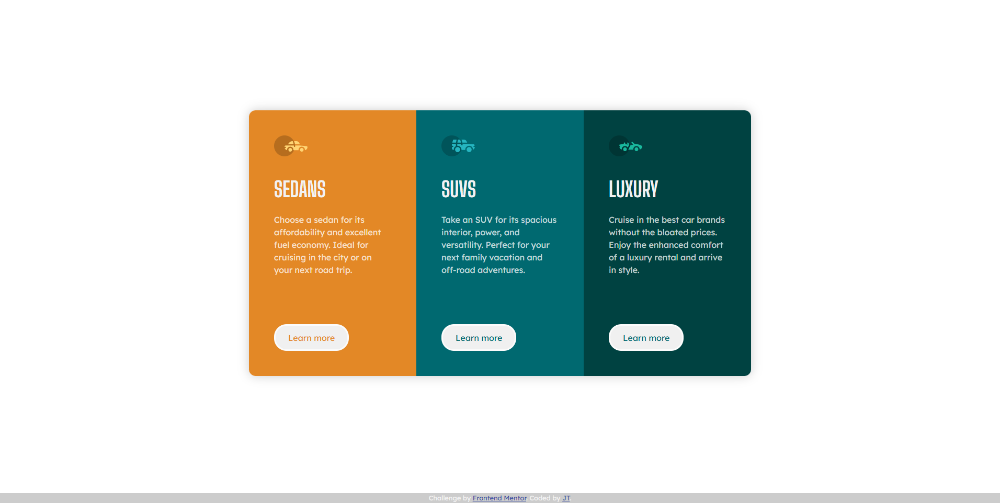

# Frontend Mentor - QR code component solution

This is a solution to the [QR code component challenge on Frontend Mentor](https://www.frontendmentor.io/challenges/qr-code-component-iux_sIO_H). Frontend Mentor challenges help you improve your coding skills by building realistic projects. 

## Table of contents

- [Overview](#overview)
  - [Screenshot](#screenshot)
  - [Links](#links)
- [My process](#my-process)
  - [Built with](#built-with)
  - [What I learned](#what-i-learned)
  - [Continued development](#continued-development)
  - [Useful resources](#useful-resources)
- [Author](#author)
- [Acknowledgments](#acknowledgments)

**Note: Delete this note and update the table of contents based on what sections you keep.**

## Overview
The second challenge I took form Frontend Mentor.

### Screenshot

### Links

- Solution URL: [Add solution URL here](https://justynatomasik.github.io/3-column-preview-card-component/)

## My process

I started with the mobile layout, using CSS Flexbox to arrange the cards, while CSS Grid is applied to the body. 

### Built with

- Semantic HTML5 markup
- CSS custom properties
- Flexbox
- CSS Grid
- Mobile-first workflow

### What I learned

This challenge gave me an opportunity to practice using Flexbox. I also wanted to add a sticky footer with credits, so I explored CSS Grid as well. This was my first experience with media queries and responsive design, and I learned more about various CSS units.

### Continued development

Try something more challenging and learn more.

### Useful resources

- [Sticky footer](https://stackoverflow.com/questions/46158844/how-can-i-have-a-sticky-footer-with-my-css-grid-layout) - how to get sticky footer with CSS Grid Layout

## Author

- Frontend Mentor - [justynatomasik](https://www.frontendmentor.io/profile/justynatomasik)

## Acknowledgments

- [Propsowicz](https://github.com/Propsowicz)

